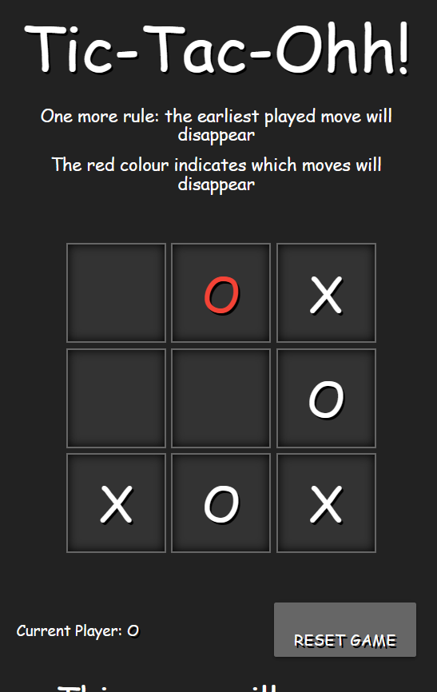
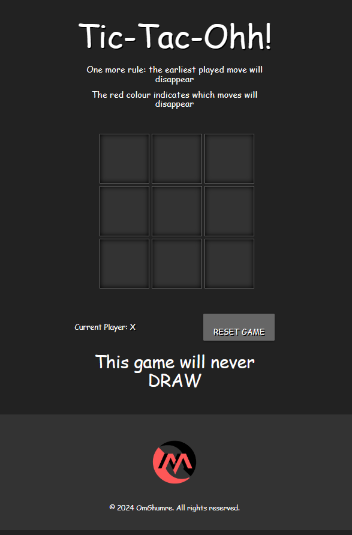
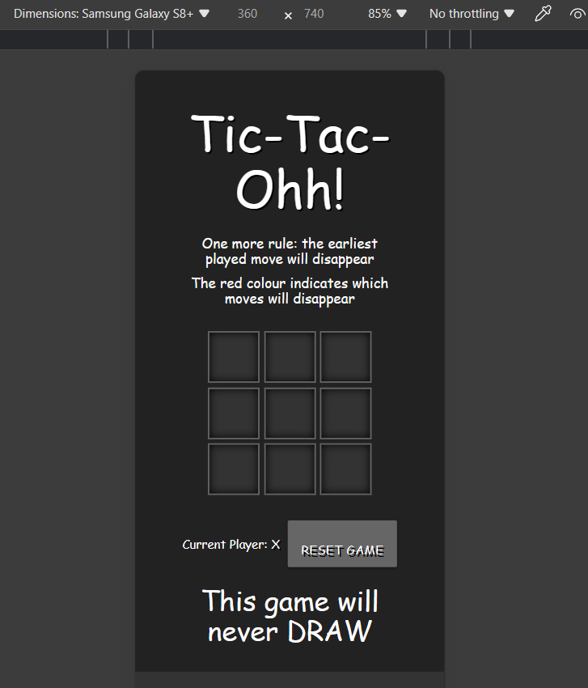

# Tic Tac Ohh!

Welcome to Tic Tac Ohh! This classic game brings back the nostalgia of retro gaming with a modern twist.This game never **DRAW**. Challenge your friends or play against the computer in this timeless battle of Xs and Os.

## Enjoy it here

https://omghumre.github.io/Tic-Tac-OHH/

https://bit.ly/tictacohh

## Features

- **New Rule: The last played move will disappear after 6 moves.**
- **Retro-inspired Design:** Immerse yourself in the nostalgic atmosphere of classic gaming with our retro-themed interface.
- **Multiplayer Modes:** Compete against friends in multiplayer mode.
- **Easy-to-use Interface:** Simple and intuitive controls make it easy for players of all ages to enjoy the game.
- **Responsive Design:** Enjoy playing Retro Tic Tac Ohh on any device, including desktops, tablets, and mobile phones, thanks to its responsive layout.
  

## Showcase

---

---

## Getting Started

To get started with Tic Tac Ohh!, simply clone this repository to your local machine and open the `index.html` file in your web browser. No additional setup or installation is required.

## How to Play

- **Take Turns Placing Xs and Os:** Click on the squares of the game board to place your marks.
- **Win the Game:** The first player to get three Xs or Os in a row, column, or diagonal wins the game.

## Technologies Used

- HTML5
- CSS3
- JavaScript

## Credits

Retro Tic Tac Ohh! was created by Om Ghumre. The game design was inspired by classic retro games, and dynamic visual feedback was added to enhance the gaming experience.

## License

This project is licensed under the [MIT License](LICENSE).

## Feedback and Contributions

Feedback, bug reports, and contributions are welcome! Feel free to submit issues or pull requests to help improve Retro Tic Tac Ohh! and make it even more enjoyable for players.

Enjoy the game and happy gaming!
